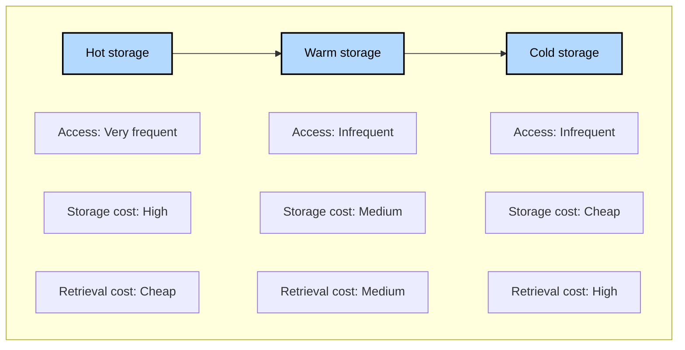
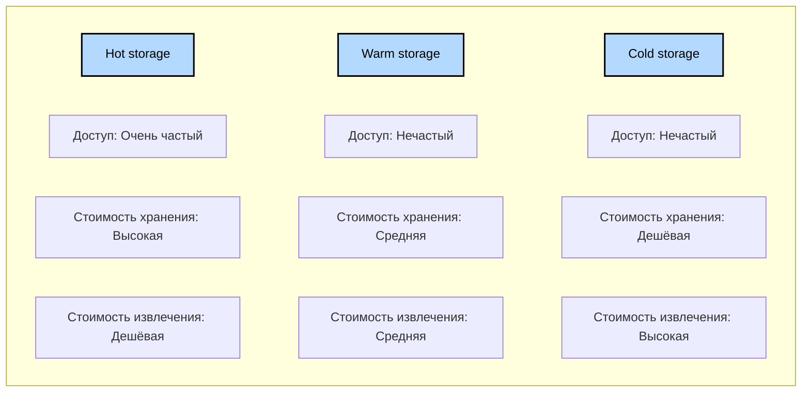

# pet_project_compression_data
https://www.notion.so/korsak0v/Data-Engineer-185c62fdf79345eb9da9928356884ea0


## О видео

## О проекте

```bash
python3.12 -m venv venv && \
source venv/bin/activate && \
pip install --upgrade pip && \
pip install poetry && \
poetry lock && \
poetry install
```
### Жизненный цикл данных и уровни хранения

EN:



RU:


