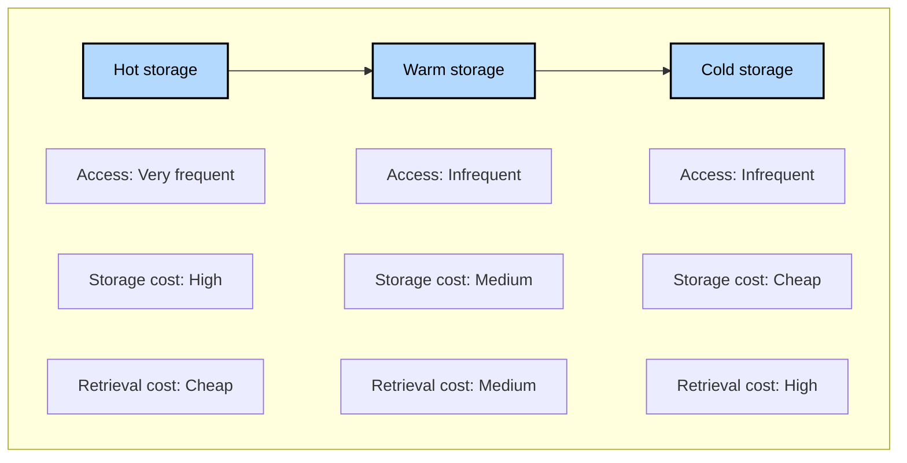
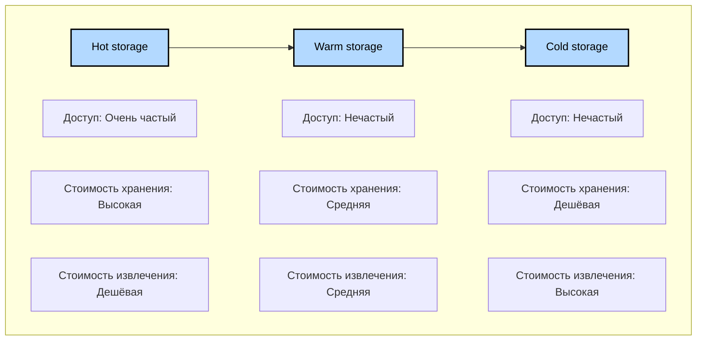

# pet_project_compression_data

https://www.notion.so/korsak0v/Data-Engineer-185c62fdf79345eb9da9928356884ea0

## О видео

🔥 Хочешь понять, как правильно хранить и сжимать данные в Data Lake? В этом [видео](https://youtu.be/rYpZNKYPSAU)
разберём, чем отличаются горячие, тёплые и холодные данные, и протестируем самые популярные форматы компрессии: Snappy,
ZSTD, GZIP и LZ4. Ты увидишь реальный бенчмарк, сравнение объёмов и затрат, а также получишь рекомендации — как
экономить на хранении в S3 и не терять производительность!

Ссылки:

- Менторство/консультации по IT – https://korsak0v.notion.site/Data-Engineer-185c62fdf79345eb9da9928356884ea0
- TG канал – https://t.me/DataLikeQWERTY
- Instagram – https://www.instagram.com/i__korsakov/
- Habr – https://habr.com/ru/users/k0rsakov/publications/articles/

🔍 Что в ролике:

- 🔥 Жизненный цикл данных: зачем делить на горячие, тёплые и холодные
- 🛠️ Генерация тестовых данных и запуск бенчмарка
- 💡 Сравнение компрессии: Snappy, ZSTD, GZIP, LZ4 — объём, скорость, ресурсы
- 🚀 Как выбрать формат под свои задачи: рекомендации для Data Lake и S3
- ⚙️ Баланс между экономией места и затратами на CPU/RAM
- 📊 Почему максимальное сжатие не всегда выгодно
- ✅ Лучшие практики для хранения больших данных

🗂️ GitHub репозиторий с кодом:
https://github.com/k0rsakov/pet_project_compression_data

📚 Мои статьи на Habr по теме:

- Инфраструктура для Data-Engineer: форматы файлов — https://habr.com/ru/articles/859968/
- Всё о DuckDB — https://habr.com/ru/articles/829502/

✉️ Нужна консультация или обучение? Пиши:

- https://korsak0v.notion.site/Data-Engineer-185c62fdf79345eb9da9928356884ea0

💡 В конце ролика — рекомендации по выбору компрессии и оптимизации хранения!

Таймкоды:

- 00:00 – Начало
- 00:10 – Жизненный цикл данных
- 04:25 – Генерация данных
- 06:08 – Проводим тестирование алгоритмов сжатия
- 16:05 – Рекомендации

#dataengineering #datalake #compression #snappy #zstd #gzip #lz4 #s3 #bigdata #benchmark #python #duckdb #parquet
#storage #dataengineer

## О проекте

### Виртуальное окружение

Настройка виртуального окружения:

```bash
python3.12 -m venv venv && \
source venv/bin/activate && \
pip install --upgrade pip && \
pip install poetry && \
poetry lock && \
poetry install
```

### Жизненный цикл данных и уровни хранения

EN:



RU:



### Генерация данных

Для генерации данных воспользуйтесь скриптом [main.py](main.py). Для изменения количества генерируемых строк измените
константу `CNT_USER`.

**Важно:** Чем больше данных – тем дольше будет выполняться скрипт.

На Mac Mini M4 Pro 24GB генерация 100'000'000 строк заняла примерно за полтора часа.

Лог выполнения скрипта:

```python
2025-10-21 04:21:56,238 - INFO - Начало генерации данных...
2025-10-21 04:26:04,725 - INFO - Сгенерировано 10,000,000 записей за 248.49 секунд
2025-10-21 04:30:16,335 - INFO - Сгенерировано 20,000,000 записей за 500.10 секунд
2025-10-21 04:34:27,552 - INFO - Сгенерировано 30,000,000 записей за 751.31 секунд
2025-10-21 04:38:42,646 - INFO - Сгенерировано 40,000,000 записей за 1006.41 секунд
2025-10-21 04:42:57,343 - INFO - Сгенерировано 50,000,000 записей за 1261.10 секунд
2025-10-21 04:47:15,828 - INFO - Сгенерировано 60,000,000 записей за 1519.59 секунд
2025-10-21 04:51:27,987 - INFO - Сгенерировано 70,000,000 записей за 1771.75 секунд
2025-10-21 04:56:23,378 - INFO - Сгенерировано 80,000,000 записей за 2067.14 секунд
2025-10-21 05:00:34,342 - INFO - Сгенерировано 90,000,000 записей за 2318.10 секунд
2025-10-21 05:04:46,355 - INFO - Сгенерировано 100,000,000 записей за 2570.12 секунд
2025-10-21 05:04:46,356 - INFO - Генерация данных завершена. Создание DataFrame...
2025-10-21 05:47:35,396 - INFO - DataFrame создан. Сохранение в Parquet...
2025-10-21 05:57:08,075 - INFO - Скрипт завершён. Всего обработано 100,000,000 записей за 5711.83 секунд
```

### Запуск JupyterLab

Выполните команду:

```bash
jupyter lab
```

### Рекомендации

- Links:
    - [Инфраструктура для Data-Engineer форматы файлов](https://habr.com/ru/articles/859968/)
    - [Всё что нужно знать про DuckDB](https://habr.com/ru/articles/829502/)
    - [pet_project_compression_data](https://github.com/k0rsakov/pet_project_compression_data)
    - [Use ZSTD compression levels](https://docs.aws.amazon.com/athena/latest/ug/compression-support-zstd-levels.html)
    - [Cost Efficiency @ Scale in Big Data File Format](https://www.uber.com/blog/cost-efficiency-big-data/)
- Мои рекомендации:
- Перед выбором всегда проводите тестирование. Иногда результаты могут удивить.
    - Стоит учитывать вашу специфику:
        - У вас могут быть в среднем файлы по 10'000 строк и там лучше подойдет условно `snappy`, а если у вас 1'000'000
          записей, может стоит использовать `zstd` с нужным уровнем. Поэтому учитывайте свою специфику данных
    - Также не забывайте, что сам формат `.parquet` использует свои форматы сжатия "*под капотом*"
    - Следить за балансом между тратой CPU/RAM/Space
    - Иногда выгоднее не так сильно сжать данные, чтобы сэкономить ресурсы
    - Максимальное сжатие не всегда лучший выбор. "Сила" сжатия может теряться в зависимости от уровня.
    - Данное тестирование синтетическое. Вам необходимо тестировать:
        - На своём оборудовании
        - Тестировать со своим хранилищем
        - Учитывать сетевые задержки
            - Учитывать, что условно хранилка S3 может быть не "*рядом*" с Executor
            - Учитывать возможный VPN у сотрудников